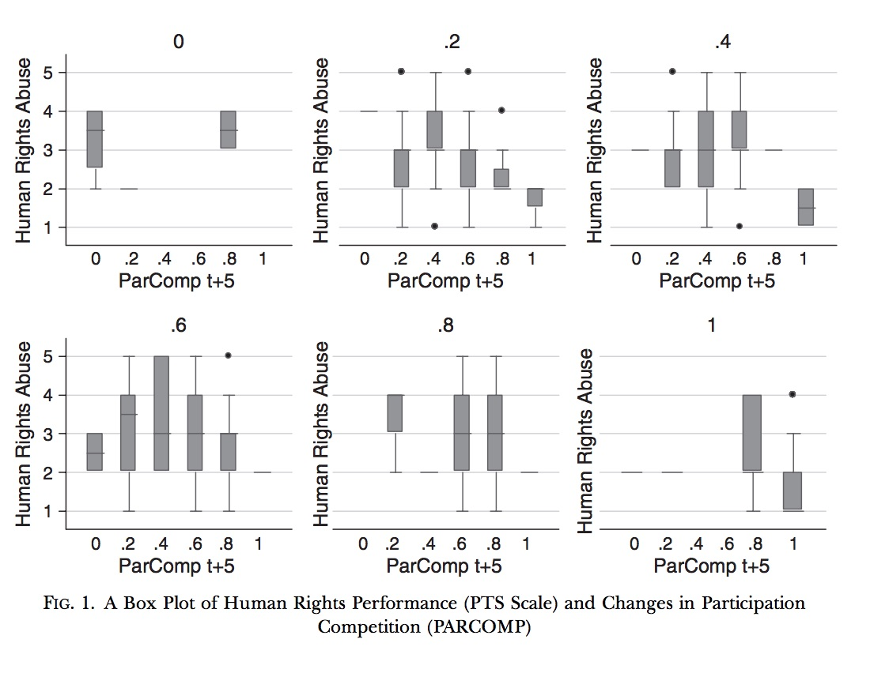

Begin reading articles using quantitative methodology, and eventually you’ll run into boxplots. 

<small>Source: de Mesquita, Bruce Bueno, George W. Downs, and Alastair Smith.  2005.  "Thinking Inside the Box: A Closer Look at
  Democracy and Human Rights."  <I>International Studies Quarterly</I>49(3): 439-457. See Figure 1, (452).</small>

Laura DeCicco has an excellent [post](https://owi.usgs.gov/blog/boxplots/) on ggplot2 boxplots. More so, the article flawlessly describes how to read boxplots, complete with excellent visualizations.  

